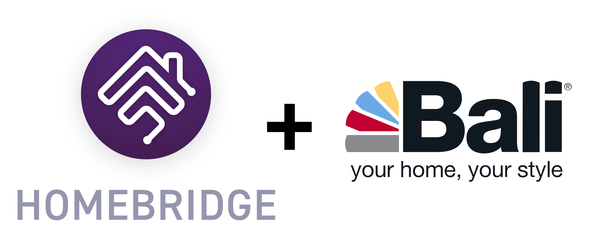
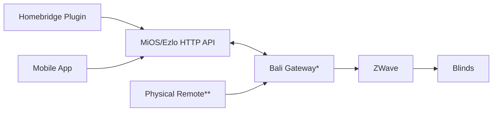

# Homebridge Plugin for Bali Blinds 

This is a [Homebridge](https://homebridge.io/) plugin for [Bali Blinds](https://www.baliblinds.com/motorization/). The Bali Motorization mobile application used to control the blinds only support Amazon Alex and Google Assistant (as of 2023) hence this plugin's existence.

(Thanks @hjdhjd, I copied some of your Install and Configuration section :smirk:)

# Installation

If you have installed the [Homebridge Config UI](https://github.com/oznu/homebridge-config-ui-x), you can intall this plugin by going to the Plugins tab and searching for `homebridge-bali-blinds` and installing it.

If you prefer to install `homebridge-bali-blinds` from the command line, you can do so by executing:

```
sudo npm install -g homebridge-bali-blinds
```

# Configuration

I strongly recommend using the [Homebridge Config UI](https://github.com/oznu/homebridge-config-ui-x) rather than editing your config.json directly. It does a good job of showing you all the options and always generating a valid configuration so you don't get stuck on typos or looking for stray commas in your config.json.

For those that prefer configuring things directly, add the accessory in `config.json` in your home directory inside `.homebridge`.

```json
    "platforms": [
        {
			"platform": "Bali Blinds",
            "baliUsername": "your-username",
            "baliPassword": "your-password",
            "lowBattery": 33 // Optional
        }
    ]
```

## Options

- `baliUsername`: *(Required)* Username from Bali Motorization mobile app.  It is recommended creating a new user in mobile app with "Basic User" permission levels since no Admin or Advanced permissions are required by this plugin.
- `baliPassword`: *(Required)* Password for the user above.
- `lowBattery`: *(Optional)* Default 33%. The percentage threshold at which the low battery status will be set on Homebridge blinds accessories.


# Fun Facts and Random Bits
I'm not an expert with IoT products, MiOS, Ezlo, Vera, or really any of the technologies used in this plugin. If you see something that doesn't make sense or could be improved please let me know by opening a GitHub issue to discuss. 

## Plugin Design

The design of this plugin is that it communicates with an HTTP API hosted by MiOS and Ezlo. This HTTP API is connected (polled I think) to the Bali Gateway device (Ezlo Atom) that communicates ZWave with the blinds. At first, I considered this solution pretty round-about when I could just speak ZWave directly to the blinds *from* Homebridge but I believe there is some benefit to not requiring more hardware. If you already have a ZWave device connected to Homebridge there are probably other plugins you can use to benefit from the direct communication. 



```
* Bali Gateway is an Ezlo Atom hub usb device
** The physical remote is Somfy brand device
```

## Documentation and References

During development of this plugin I used various references including but not limited to:

- Legacy MiOS documentation since it appears Bali Motorization is built on legacy cloud infra: https://developer.mios.com/api/legacy-cloud-api/documents/
- This gist from @cgmartin https://gist.github.com/cgmartin/466bd2d3724de6c04743d61cf0de2066 which I adapted to Bali https://gist.github.com/bostrt/f8189ce83e6fa6fb573aea2f1e76b723
- The Bali Motorization Android APK for `PK_Oem` and `AppKey` parameters.
- Ezlo Hub Kit source code which this plugin is very roughly based on: https://github.com/bblacey/ezlo-hub-kit/

# Development

See [DEVELOPMENT.md](DEVELOPMENT.md)

## Plugin Development Dashboard

[](https://github.com/bostrt/homebridge-bali-blinds/blob/main/LICENSE)
[](https://github.com/bostrt/homebridge-bali-blinds/actions)
[](https://www.npmjs.com/package/homebridge-bali-blinds)
